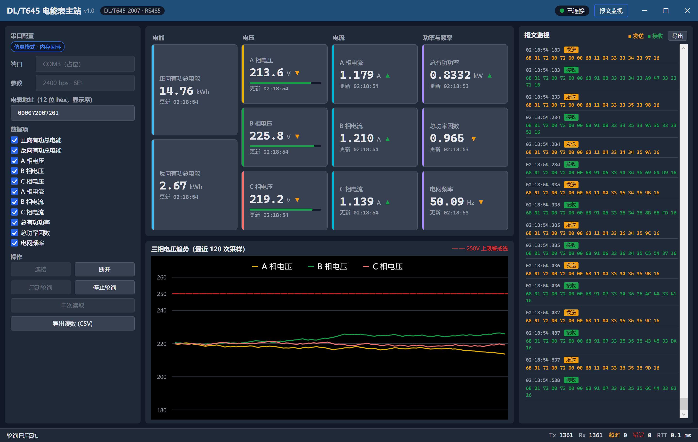
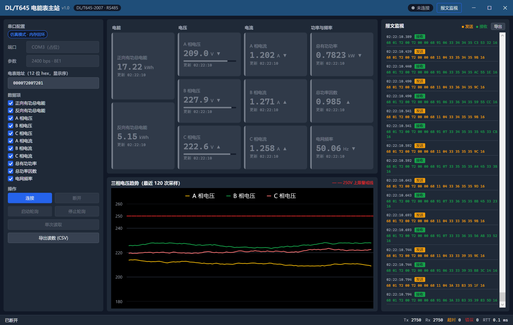

# DL/T645 电能表主站

基于 **DL/T645-2007** 规约的多功能电能表通信调试上位机（.NET 8 / WPF / MVVM）：通过 RS485 串口轮询电能表的电量、电压、电流、功率等数据，实时卡片墙 + 三相电压趋势图 + 报文监视，内置仿真从站——**没有真表也能克隆即跑**。



## 运行演示
https://github.com/user-attachments/assets/e41ac0b8-cdba-490f-ab88-acab334b6b1f



## 核心特性

- **零硬件即可运行**：内置 DL/T645 仿真从站与内存回环传输，克隆后直接启动，完整走通「连接 → 轮询 → 组帧 → 解析 → 展示」全链路。仿真数据按电网物理特性标定：频率在 49.90~50.10 Hz 随机游走、功率因数钳制 0.93~0.99、三相电压 209~235 V、电能只增不减单调走字。
- **139 个单元测试全绿**：协议编解码契约测试（含手工推演的黄金报文向量）、帧扫描器增量组帧、收发统计口径、视图模型命令状态机、波动数据源长序列值域断言、CSV 导出转义与不变文化序列化。
- **严格分层架构**：Core 纯类库（协议 + 领域模型 + 轮询服务，零框架依赖）/ Transport（真实串口 + 仿真回环）/ App（Prism + MVVM）。`ITransport` 接口置于 Core，服务层只依赖抽象——真实串口与仿真回环互换只改一行装配代码。

## 功能清单

- 多数据项周期轮询（一问一答、半双工串行）与单次读取
- 实时电参数卡片墙：按电能/电压/电流/功率与频率分组，涨跌箭头、电压 250V 占比进度条，断开后转离线灰并保留末次数值
- 三相电压趋势图（LiveCharts2，120 点滚动窗口，250V 红色虚线警戒线）
- 报文监视：收发分色、时间戳、自动滚底、上限 500 条，可导出为文本文件
- 读数记录导出 CSV（UTF-8 带 BOM，Excel 直接打开中文不乱码；缓冲 20000 条约合半小时数据）
- 通信统计：Tx/Rx 帧数、超时、错误、往返时延
- 深色工业 HMI 主题、自定义标题栏（拖拽/双击最大化/分屏吸附）



## 快速开始

环境要求：Windows 10/11，[.NET 8 SDK](https://dotnet.microsoft.com/download/dotnet/8.0)。

```powershell
git clone https://github.com/Jayla630/Dlt645Master.git
cd Dlt645Master
dotnet build
dotnet test
dotnet run --project src/Dlt645Master.App
```

启动后默认已装配仿真链路（内存回环 + 仿真从站），界面操作三步走：

1. 点击 **连接**（标题栏徽标转绿色「已连接」）；
2. 点击 **启动轮询**——卡片墙数值开始跳动、三相电压曲线滚动、右侧报文监视滚屏；
3. 观察数分钟后可点 **导出读数 (CSV)** 或报文监视区的 **导出**；**停止轮询** → **断开** 收尾。

## 架构说明

```
┌─────────────────────────────────────────────────────────┐
│  Dlt645Master.App          WPF + Prism（MVVM）           │
│  Views / ViewModels / 仿真链路装配 / 导出                  │
└──────────────┬──────────────────────────┬───────────────┘
               │ 依赖                      │ 依赖
┌──────────────▼──────────────┐  ┌────────▼────────────────┐
│  Dlt645Master.Core          │  │  Dlt645Master.Transport │
│  纯类库，零框架依赖           │◄─┤  依赖 Core               │
│  ├ Protocol  帧编解码/组帧    │  │  ├ Serial   真实串口     │
│  ├ Models    领域模型         │  │  └ Simulation 仿真从站/  │
│  ├ Services  轮询调度/统计    │  │      内存回环/波动数据源   │
│  └ Transport ITransport 抽象 │  └─────────────────────────┘
└─────────────────────────────┘
```

三条关键设计取舍：

- **`ITransport` 抽象放在 Core**：服务层（轮询调度）只依赖这个接口，不知道对面是 `System.IO.Ports` 还是内存回环。真实串口切换只需把装配处的 `LoopbackTransport` 换成 `SerialPortTransport`，其余代码一行不动，也因此消除了 Core → Transport 的环形依赖。
- **事件线程口径明确**：轮询服务的三个事件（读数完成/报文收发/统计变更）一律在后台工作线程触发，服务层不做线程封送；视图模型统一经 `IUiDispatcher` 抽象调度回界面线程（测试中用同步替身，无需真实消息泵）。
- **字节序约定单点化**：地址与数据标识在所有接口/模型中一律为「显示序（高位在前）」，只有帧编解码器内部上/下线时转换为传输序（低位在前）——转换点唯一，杜绝「反了两次等于没反」类缺陷。

## DL/T645-2007 规约要点

帧结构：`68 A0..A5 68 C L DATA... CS 16`（地址 6 字节 BCD 低位在前；DATA 域每字节 +0x33 掩码；CS 为算术和校验）。

默认串口参数：**2400 bps · 8 数据位 · 偶校验 · 1 停止位**（规约常用默认值，已内置）。

| 数据项 | 数据标识 DI | 单位 |
| ------ | ----------- | ---- |
| 正向有功总电能 | 00 01 00 00 | kWh |
| 反向有功总电能 | 00 02 00 00 | kWh |
| A/B/C 相电压 | 02 01 01~03 00 | V |
| A/B/C 相电流 | 02 02 01~03 00 | A |
| 总有功功率 | 02 03 00 00 | kW |
| 总功率因数 | 02 06 00 00 | — |
| 电网频率 | 02 80 00 07 | Hz |

> DI 表以 DL/T645-2007 附录 A.2 为准；其中电网频率的 DI 为占位值，对接真表前需按标准原文核对。

## 技术栈与版本说明

| 库 | 版本 | 锁定理由 |
| --- | --- | --- |
| .NET | 8.0 | 当前 LTS |
| Prism.DryIoc | 9.0.537 | MVVM 基础设施 + DI 容器 |
| LiveCharts2 (SkiaSharpView.WPF) | **2.0.4（锁定）** | 首个正式版，MIT 许可证；禁用浮动版本保证可重现构建 |
| FluentAssertions | **7.2.2（锁定）** | 8.x 起改为 Xceed 非商业社区许可证，7.2.2 是最后一个 Apache-2.0 版本 |
| xUnit | 2.9 | 测试框架 |

依赖许可证均为 MIT / Apache-2.0，与本仓库 MIT 许可证无传染冲突。

## 后续规划

- 真实串口运行时切换（串口/波特率下拉选择，装配处 `ITransport` 改工厂注入）
- 报文解析详情面板（点击报文条目展开地址/控制码/DI/数值的字段级解读）
- 轮询参数界面化配置（周期/超时/帧间延时）
- 多表地址管理与批量轮询
- 读数数据持久化（SQLite）与历史查询

## 许可证

[MIT](LICENSE) © 2026 Jayla630
